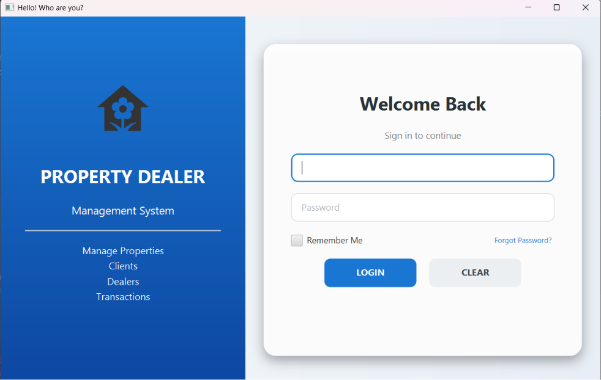
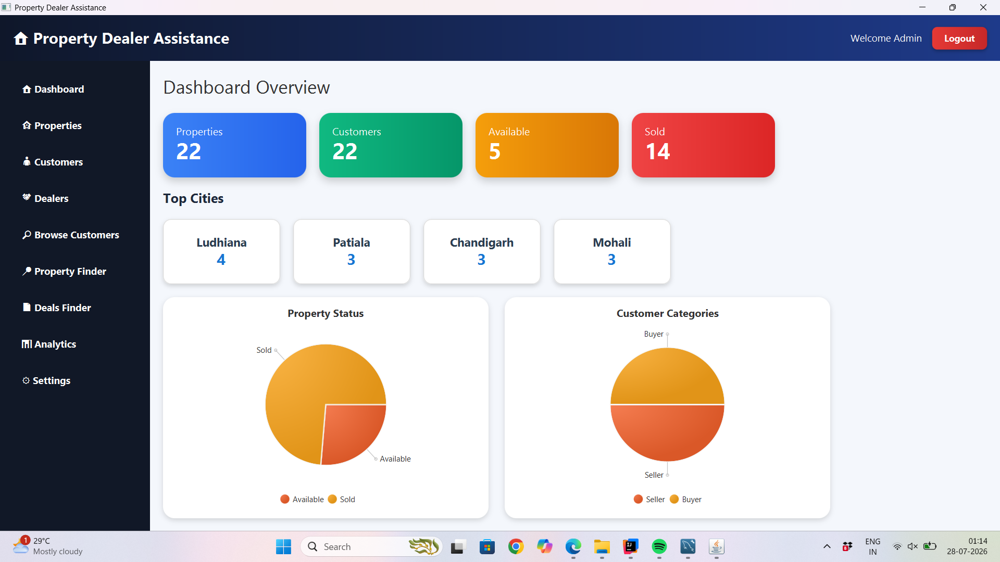
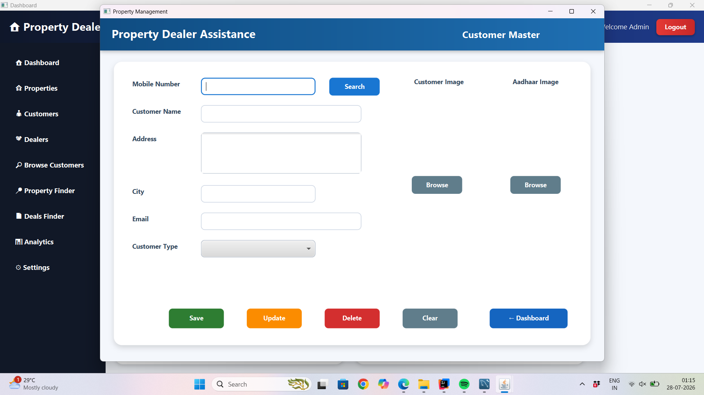
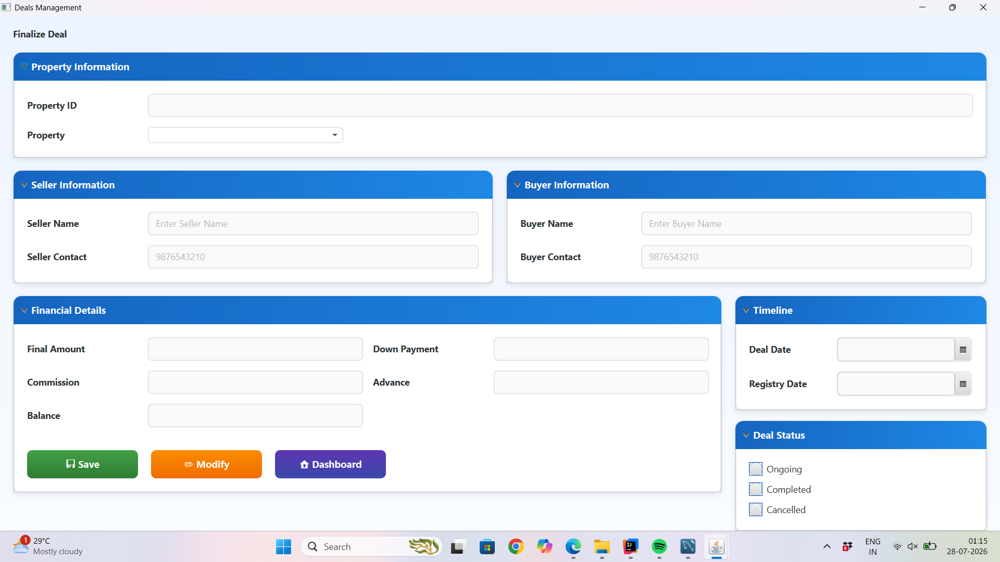
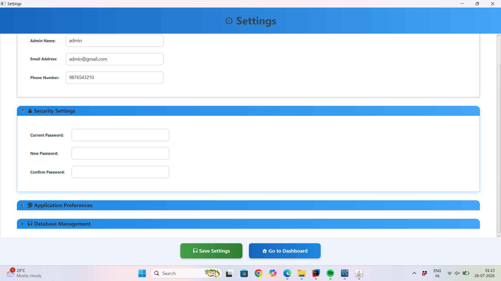

#  Property Dealer Assistance

A JavaFX-based desktop application designed to simplify property dealer operations. The system provides an intuitive interface for managing properties, customers, deals, and business analytics using a MySQL database.

---

##  Features

-  Secure Admin Login
-  Dashboard with Analytics
-  Customer Management
-  Property Management
-  Deal Management
-  Property Finder
-  Business Analytics
-  Application Settings
-  MySQL Database Integration

---

##  Tech Stack

- Java 17+
- JavaFX
- Maven
- MySQL
- JDBC
- BCrypt (Password Encryption)

---

## 📷 Screenshots

### 🔐 Login



---

### 📊 Dashboard



---

### 👥 Customer Management



---


### 🤝 Deal Management




---

### ⚙️ Settings



##  Project Structure

```
Property-Dealer-Assistance
│
├── src/
│   ├── main/
│   │   ├── java/
│   │   └── resources/
│
├── database/
│   └── propertydealer.sql
│
├── config.properties.example
├── pom.xml
├── README.md
└── .gitignore
```

---

#  Getting Started

## 1. Clone the Repository

```bash
git clone https://github.com/dssingla/Property-Dealer-Assistance.git
cd Property-Dealer-Assistance
```

---

## 2. Requirements

Install the following software:

- Java JDK 17 or later
- IntelliJ IDEA (Recommended)
- Maven
- MySQL Server 8+

---

## 3. Database Setup

Create a database named:

```sql
CREATE DATABASE propertydealer;
```

Import the SQL schema.

### Using MySQL Workbench

1. Open **MySQL Workbench**
2. Go to **Server → Data Import**
3. Select **Import from Self-Contained File**
4. Choose:

```
database/propertydealer.sql
```

5. Select database:

```
propertydealer
```

6. Click **Start Import**

---

## 4. Configure Database

Copy

```
config.properties.example
```

Rename it to

```
config.properties
```

Update the database credentials.

Example:

```properties
DB_URL=jdbc:mysql://localhost:3306/propertydealer
DB_USERNAME=root
DB_PASSWORD=your_password
```

---

## 5. Install Dependencies

Using Maven:

```bash
mvn clean install
```

or simply open the project in IntelliJ IDEA and let Maven download the dependencies automatically.

---

## 6. Run the Application

Run the following class:

```
HelloApplication.java
```

or from the terminal:

```bash
mvn javafx:run
```

---

## 🔨 Build Executable

Generate the project build using:

```bash
mvn clean package
```

The generated JAR file will be available in:

```
target/
```

---


##  Notes

- `config.properties` is ignored by Git for security reasons.
- `config.properties.example` is included as a template.
- The `installer/` folder and generated executable are not included in the repository.
- Update your database credentials before running the application.

---

##  Contributing

1. Fork the repository.
2. Create a feature branch.

```bash
git checkout -b feature-name
```

3. Commit your changes.

```bash
git commit -m "Add new feature"
```

4. Push to GitHub.

```bash
git push origin feature-name
```

5. Open a Pull Request.

---

##  Author

**Deepak Singla**

GitHub: https://github.com/dssingla

---

##  License

This project is intended for educational and learning purposes.